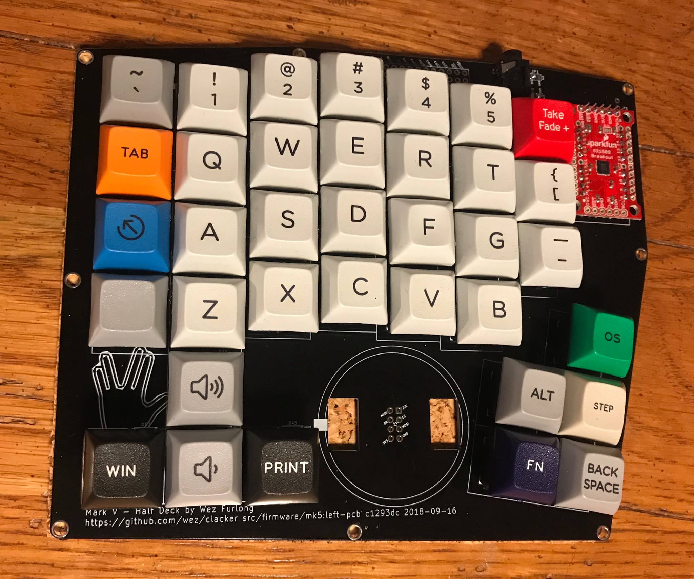
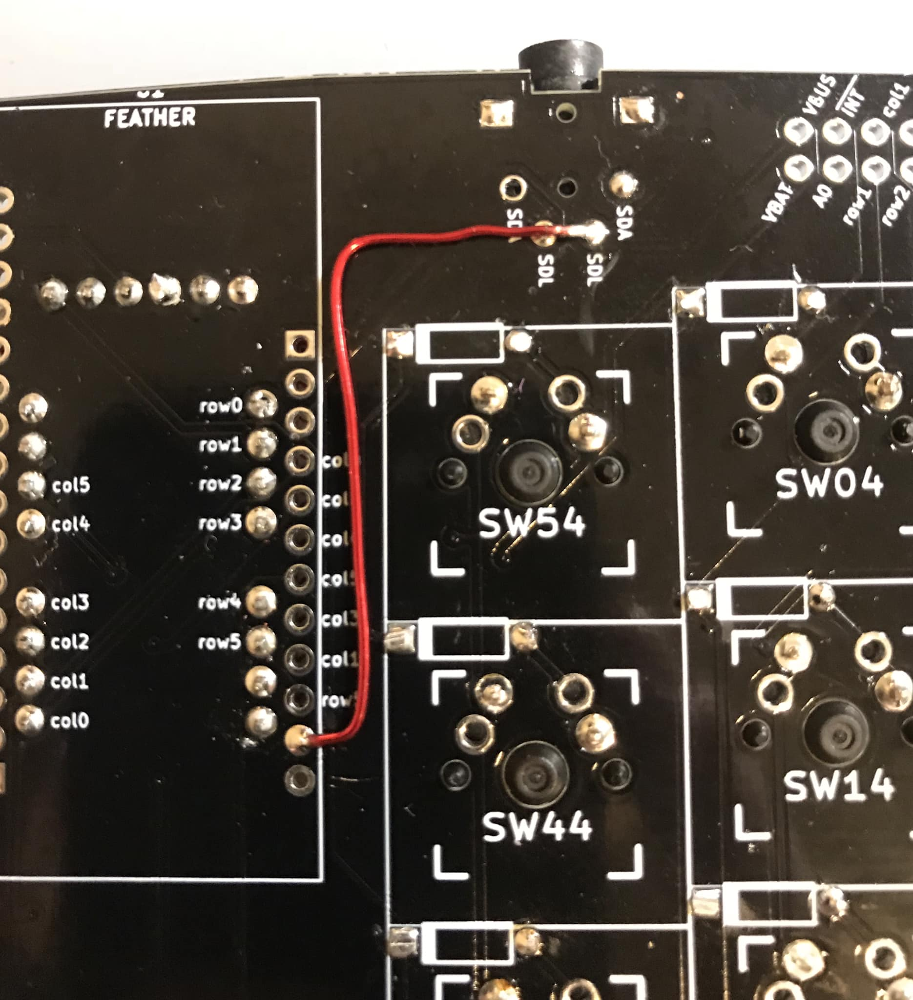
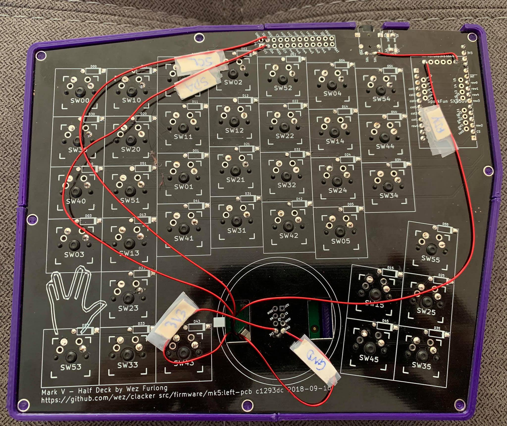
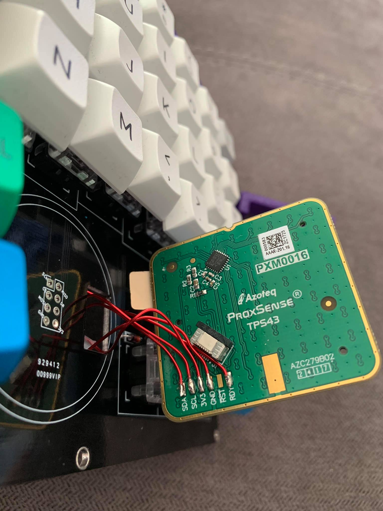

# Half Deck - Mk 5

This is my fifth keyboard design.  This repo will be updated as I get around to
expanding the data here.

This is a split keyboard in two halves.  One half has a microcontroller that
implements USB and communicates with the other half using a two-wire bus
protocol known as I2C.

The other half has an IO expander component that is connected to the keyboard
matrix and that can be queried over I2C.

A TRRS (Tip-Ring-Ring-Sleeve) cable is used to connect the two halves; this is
a 4-wire cable that carries the power and I2C signals to the IO expander.

## Firmware

You can find example firmware for an atmega32u4 based Feather board here:
https://github.com/wez/qmk_firmware/tree/flutterby-rebased/keyboards/halfdeck

## Before you begin

The PCBs are double sided so that the same design can be used to build either
the RHS or the LHS of the keyboard.  Make sure you read through this doc and
understand where you're going to place the components before you cut or solder
anything, as it can be difficult to undo those actions.

If you are using a plate with your keyboard (eg: the top acrylic plate with the key
switch holes), keep in mind that you can't solder in any of the switches until
you have the plate as the switches effectively bolt the plate to the PCB.
If your plate material is thicker than ~1.6mm then it won't clip into the small
lugs on the switches and you may need to add some M3 spacers to raise the plate
up to the appropriate height; depending on how you flush you solder your diodes
that may not be required.

The labels for the controller and IO multiplexer are biased towards right
handed users, or rather, assume that the touchpad be located on the RHS.  If
you want to place it on the LHS you will need to swap the multiplexer and the
controller.  This should be straightforward, but will require attaching those
components upside-down.  Pay careful attention to the labels on the pins to
ensure that you have things placed correctly!

## Assembly - Left Hand

The top of the PCB faces up for the Left Hand.  You'll know you've got it facing the
correct direction because it has a graphic showing a left hand in the bottom left
corner, as well as some version information down there.

You will place the key switches on this side of the board for the left hand but
solder them in on the other side.

If you are right handed and also want to connect a touch pad, you will connect
the SX1509 on this half.

If you are left handed and also want to connect a touch pad, you will connect
the controller and the touch pad on this half.

### I2C Jumper configuration

On the top edge of the PCB there is a little notch where the TRRS connector
will be fitted.  To the right of that area is a pair of solder jumpers labelled
`JP1` and `JP2`.  These are present to allow setting up the same PCB for either
left or right handed usage and control which pins of the TRRS connector are
connected to the power and ground lines.

Each jumper consists of three rectangles.  The middle of the three needs to
be bridged to *either* the left or the right pad using either excess solder
or a short section snipped off of one of the diode legs.  Controlling excess
solder can be difficult, so I would suggest using a diode leg trimmed to size
if you're not confident, or you don't have a solder sucker on hand to undo.

* `JP1` must be bridged to `3V3`
* `JP2` must be bridged to `GND`

It's not the end of the world if you mix this up, so long as each jumper either
goes to `GND` or `3V3`.  They must not both be set to the same thing or you
risk damaging your electronics.

This image shows the jumpers for the LHS:

## Assembly - Right Hand

The bottom of the PCB faces up for the Right Hand.  You'll see a graphic
showing a right hand in the bottom right corner of the PCB.

You will place the key switches on this side of the board for the right hand
but solder them in on the other side.

If you are right handed and also want to connect a touch pad, you will connect
the controller and the touch pad on this half.

If you are left handed and also want to connect a touch pad, you will connect
the SX1509 on this half.

### I2C Jumper configuration

Similar to the note on the Left Hand, but the Right Hand absolutely must have
the opposite settings to the Left Hand!

* `JP1` must be bridged to `GND`
* `JP2` must be bridged to `3V3`

While the PCB is mostly reversible, the jumper blocks are only present on
one side of the board, so you need to flip it over to configure them.

This image shows the jumpers for the HHS:

## Errata

The first batch of these boards have a minor issue with the `SCL` line; due to
a typo it isn't actually connected to the TRRS jack.  You will need to bridge
the misnamed `SDL` pads to the `SCL` pads on each side.

### Patching the RHS

### Patching the LHS

## Recommended Order of Assembly

1. Diodes
2. The TRRS connectors
3. Jumpers (I2C and the Errata section above)
4. Header strip for the controller/expander
5. Key switches
6. Touchpad

## Diodes

The diodes are directional; they allow current to flow in a single direction.
Their purpose in the circuit is to prevent ghosting.  If you attach one in
the wrong direction it can be hard to debug and isolate if you don't have
a multimeter, so take care to make sure you've placed them correctly.

The diodes have a black line at one end.  The black line must be aligned with
the thick white line in the diode outline on the PCB.  The solder pad on that
side is square, which is another visual cue; think *black, thick, square*.

Bend the legs of the diode so that you form a slender `n` shape, with the diode
body at the top of the `n`.  The goal is to have the diode body lay flush against
the PCB within the outline on the pcb, so you want the legs to bend and fit the
holes at either end of the outline.

I'd suggest taking your time with the first one and perhaps solder that one
before placing the rest to make sure you understand how it will fit.  Make
sure that you have it oriented correctly before soldering!

To solder the diodes, the technique is important.  You're placing the diodes
on the side of the board facing up but you need to solder them on the back side
of the board.  I bend the legs to form a `V` shape to keep the diodes in place
when you flip the board over:

Once you've placed the diodes, check again to make sure that you have them
facing the right direction (*black, thick, square*) and solder them in.  You
want enough solder that you fill the hole with a nice shiny blob, and you want
it to be very slightly convex.

Be careful with the diode legs: you can easily prick yourself on the legs and
the human reflex to suddenly move away from the prick can be dangerous if one
of your hands is holding a hot soldering iron!

After soldering, double check the orientation of the diodes again: it's not
super easy to correct at this point, but it will get much harder if you
discover a problem later because the next step is to snip off the diode legs.

Use your angle/flush cutters for this; lay the edge of the cutters flush with
the board and snip off the leg where it comes through the hole.  Ideally you
want to trim it such that you're just left with a small convex mound of solder
around the hole.  I recommend holding the leg with one hand while you snip; the
picture below doesn't show this because I was holding the camera to take the
picture.  The reason for holding the leg while snipping is that it can jump off
your work surface and land on the floor.  If you're not diligent at tracking
and picking up the legs from the floor, it is easy for someone to stub/stab a
toe with a diode leg.  While they're not super sharp, they're small enough that
they can jab in a few millimeters and draw blood.

## TRRS Connectors

Attaching these is pretty straightforward; look for the little notch in the PCB
near the I2C jumpers.  The notch makes room for the circular opening in the
connector.  Place the legs of the component through the holes and solder on the
other side.

If you are using a plate with your keyboard, check to see whether you have enough
clearance to mount the connector on the switch side of the plate.  If you
have an acrylic plate than I suspect that there won't be enough clearance.
If you're using a 1.6mm plate then it looks like it might just fit.

In the pictures in this guide, I built without a plate and placed the connectors
on the top side of the PCB.

## Header Strip for Controller and Expander

I recommend using some header strip to mount these components.  The controller
comes with appropriately sized strip but you'll need to obtain some more header
to mount the IO expander.

Similar consideration as the TRRS connector: make sure that you have enough
clearance to place the components and your plate if you're using a plate.  You
may need to mount the components on the opposite side of the board to
accomodate your plate.   Note that you can also [buy short header
strip](https://www.adafruit.com/product/3002) for lower profile builds.

This image shows the header strip placement for the IO Expander:

When soldering the header be prepared: `GND` is attached to a larger ground
plane fill in that area of the board; there's large region of copper under the
surface coating and that means that it will soak up the heat from your iron and
be more difficult/take longer to solder than the surrounding pins. You may
notice that the PCB in that region is noticeably much hotter.  This is fine.

## Key Switches

These should also be pretty simple to place, especially if you ordered PCB
mounted switches.  The PCB mounted switches have a couple of extra legs to
ensure that the switch is correctly aligned in the PCB.  If you have plate
mounted switches, those lugs are not present because the plate is supposed to
orient and align the switches.

If you're using plate mounted switches on the PCB and are not using a plate
you will need to take extra care to ensure that the switches mount square
and consistently, otherwise your keycaps will be misaligned.

Press the key switches into the mounting holes; make sure that the metal legs
of the switch poke through the other side.  If you don't see a leg poking
through it means that the leg is most likely folded flat; remove the switch and
straighten the leg and try again.

Make sure that the switches are pushed in snugly and that the switches are
flush with the PCB, otherwise your keycaps will be misaligned.  You may hear or
feel a click when the switch is well placed.

I tend to place all of the switches at once, then flip the board over and
solder them in.  Before you solder, make sure that none of the switches shifted
during the flip.  In my test build the tolerance on the hole was good and the
switches were held in just fine, but depending on your switches you may find
that one or two of them are a little loose and need to be re-seated.

## Touchpad

I tried two different touchpad models.  The one I'm most happy with is the
Azoteq TPS43-201A-S, which is a 43mm approximately-square touchpad which
connects to the I2C bus on this keyboard.  When I designed the board I
though I was going to use a different touchpad that was connected via SPI,
so the mounting area on the board breaks out the SPI pins but not the I2C
pins.  That means that connecting the touchpad requires a couple of bridging
wires to connect across the backside of the pcb.

The touchpad is shipped with a removable 3M adhesive pad on the touch surface;
**keep this attached to the touchpad** (well, you can peel back a corner and
take a peek at the sensor grid if you like).  The purpose of this is to ensure
that you have no air gap between the capacitive touch grid on the touchpad
surface and the touch surface.  The 3M label makes a reasonable touch surface,
but you may want to consider placing your own more permanent and aestheticly
pleasing surface in its place.  The datasheet recommends a surface that is no
more than 3mm thick, and it should be something that doesn't interfere with the
capacitive field.

### Touchpad Wiring

Prepare your bridging wires; you'll need 3 that are long and two that are relatively
short.  You'll want to give yourself a little slack but not so much that
the wires crowd out the underside of your board.

Here's a picture of the wiring on the reverse of the PCB so that you can
visualize this a little better; the slack allows popping off the case in
the event that you need to get inside the board and clean it.

The touchpad itself provides solderable pads that are just perfect for
our needs:

The pads are connected to the PCB via the briding wires:

| Touchpad | PCB |
| -------- | --- |
| SDA      | SDA - on the header block at the top of the board |
| SCL      | SCL - on the first rev of the PCB this is mislabeled as SDL on the header block at the top of the board |
| 3V3      | 3V3 - in the header block in the circle at the bottom of the board |
| GND      | GND - in the header block in the circle at the bottom of the board |
| RST      | Not connected |
| RDY      | ~INT - the interrupt pin behind the microcontroller |

### Orientation of the touchpad

The top edge of the touchpad has a small notch.  When the touchpad is placed
on the board, the solder pads for the connections listed in the table above
will be in the bottom right of the touchpad if you look down from the top
surface of the touch pad.

While you're soldering you'll have it facing up the other way and so those pads
will be in the bottom left of the underside of the touchpad.

### Mounting the touchpad

I've only made this work when integrating with the 3D printed flavor of the case.
You'll need the [touchpad_stand](case/touchpad_stand.stl) to raise the pad up to
the level of the case.  There is an open side in the touchpad stand that is intended
to allow your wiring to pass through; the idea is that you don't want to solder your
wires into the stand as you won't be able to remove it without de-soldering.

## Case

In the [case](case) directory you'll find a number of files to use for the case.  You
have a couple of options:

### 2D laser cut sandwich style case

This is the simplest case design, but because it is 2D doesn't have a story for (literally)
supporting the touchpad.  There are no sides to the case and the idea is that
you assemble it using some M3 standoffs/spacers and nuts and bolts.  There are a number
of SVG files in the repo that can be used to assemble a case.  For example, you can
take [this one](case/half-deck-case-bottom-and-switch-plate-no-touch-pad-ponoko-p2.svg)
to [Ponoko](https://www.ponoko.com/) and select you preferred color of acrylic P2 material.

### 3D printed case (work in progress)

This one is your best option when using a touchpad.  There are a couple of parts to print in
the current iteration.  These are for a right handed build including a touchpad.  You can
mirror the parts if you want a left handed build with a touchpad, or just mirror the left
half if you want a right half with no touchpad:

 * [left half](case/left-case.stl)
 * [right_half](case/right-case.stl)
 * [touchpad_stand](case/touchpad_stand.stl)
 * Currently missing: bottom cover.  It's not strictly needed as the case has a lip
   with sufficient clearance, but you can extrude [case-bottom.svg](case/case-bottom.svg)
   and print that or just laser cut it from some other material if you really need
   something.

You'll need some M3 bolts to attach the PCB to the case and something like these
[heat-set embedment nuts](https://www.amazon.com/gp/product/B01IYWTCWW)
to provide threads that you can screw the bolts into.  Check out 
[this page](https://www.3dhubs.com/knowledge-base/how-assemble-3d-printed-parts-threaded-fasteners)
for more information.

If you don't have a 3D printer you can upload these files to somewhere like
[3D Hubs](https://www.3dhubs.com/) and have them printed for you at a cost of
around $50 for one set, plus shipping.

If you do have a 3D printer but it isn't large enough to print these models, you'll
find a set of `sliced_case` files in this repo that are divided into quarters that
are printable in a printer with a 140 cubic mm volume.  These are cut in such a way
that the pieces lock together when mounted on the PCB.

